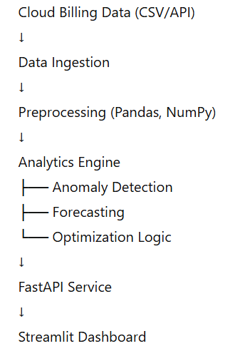

# Cloud FinOps Cost Optimization & Anomaly Detection Engine

## Overview

Cloud FinOps Engine is a Python-based cloud cost intelligence system that analyzes billing data, detects cost anomalies, forecasts future spend, and generates optimization recommendations.

Built with a product-oriented mindset, this system demonstrates backend architecture, financial analytics, and cloud-aware optimization logic relevant to modern FinTech environments.

---

## Key Capabilities

- Cost anomaly detection using statistical and ML-based methods
- Time-series forecasting of cloud spend
- Resource optimization recommendations (rightsizing, idle detection)
- FastAPI analytics service for integration
- Streamlit dashboard for real-time visualization

---

## Architecture

---

## Tech Stack

- Python
- Pandas
- NumPy
- Scikit-learn
- FastAPI
- Streamlit

---

---

## Setup Guide

### 1. Clone Repository

git clone https://github.com/
<your-username>/cloud-finops-engine.git
cd cloud-finops-engine

### 2. Create Virtual Environment (Recommended)

python -m venv venv
Windows: venv\Scripts\activate
Mac/Linux: source venv/bin/activate

### 3. Install Dependencies

pip install -r requirements.txt

## Run FastAPI Backend

- python -m uvicorn app.api:app --reload
- API will be available at: http://127.0.0.1:8000

## Run Dashboard

streamlit run dashboard/dashboard.py

## Optimization Logic

The engine identifies:

- Underutilized instances (low CPU utilization)
- Idle resources (active instances with zero utilization)
- Cost spikes exceeding statistical thresholds
- Potential savings through rightsizing strategies

## Sample Use Case

This project simulates a FinTech cloud environment where:

- Daily cloud cost is monitored
- Sudden cost spikes are flagged
- Future expenses are predicted

## Future Enhancements

- Isolation Forest anomaly detection
- AWS Cost Explorer API integration
- Slack/Email alerting system
- Kubernetes deployment
- CI/CD using GitHub Actions
- Role-based dashboard authentication
